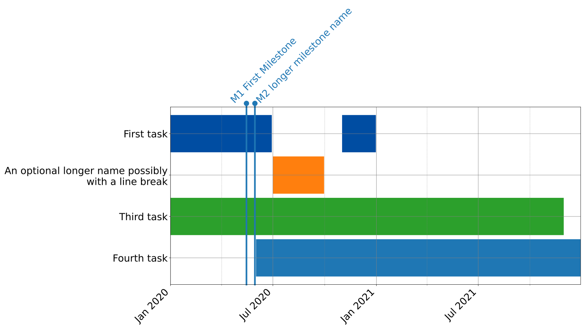

# Create a Gannt plot from a yaml file with tasks 

## Basic usage
* modify ``tasks.yml`` to suit your needs. 
* Run ``./plotGannt.py``. This will create the output ``Gannt.svg`` from the file ``tasks.yml``

## more advanced usage
* see ``/plotGannt.py --help``
```
usage: plotGannt.py [-h] [-o OUTPUTFILE] [-l LOCALE] [-r ASPECTRATIO]
                    [YAMLTASKFILE]

 Make a Gannt plot from the tasks in a configuration file

positional arguments:
  YAMLTASKFILE          Specify the inputfile for the tasks (default is tasks.yml)

optional arguments:
  -h, --help            show this help message and exit
  -o OUTPUTFILE, --output OUTPUTFILE
                        Specify the output graphicsfile (e.g. Gannt.svg(default), Gannt.png or Gannt.pdf),
  -l LOCALE, --locale LOCALE
                        Set the locale used for formatting dates e.g. (de_DE), defaults to en_US
  -r ASPECTRATIO, --ratio ASPECTRATIO
                        Specify the aspect ratio (w/h as a float)  of the plot, defaults to 16:9

```
## Specifying epochs in the yaml file
Dates can be specified by a datestring format which is understood by [dateutil](https://dateutil.readthedocs.io/en/stable/). Alternatively one can specify an increment in days `+xxd` or months `+xxm` which will be added to the `tstart` variable as specified in the yaml file (see tasks.yml for an example).


# Example

